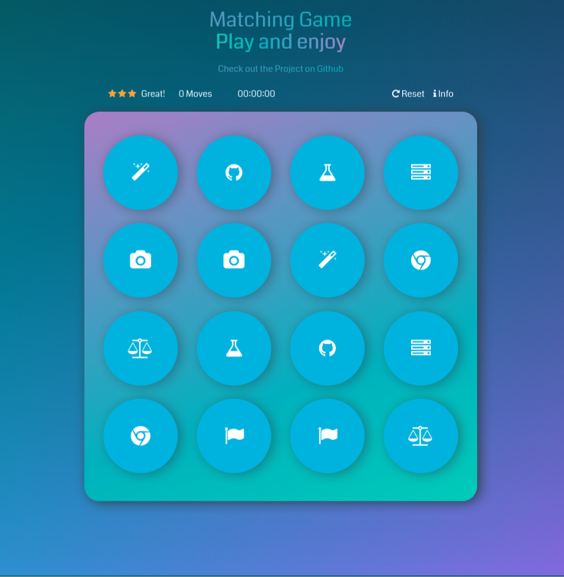
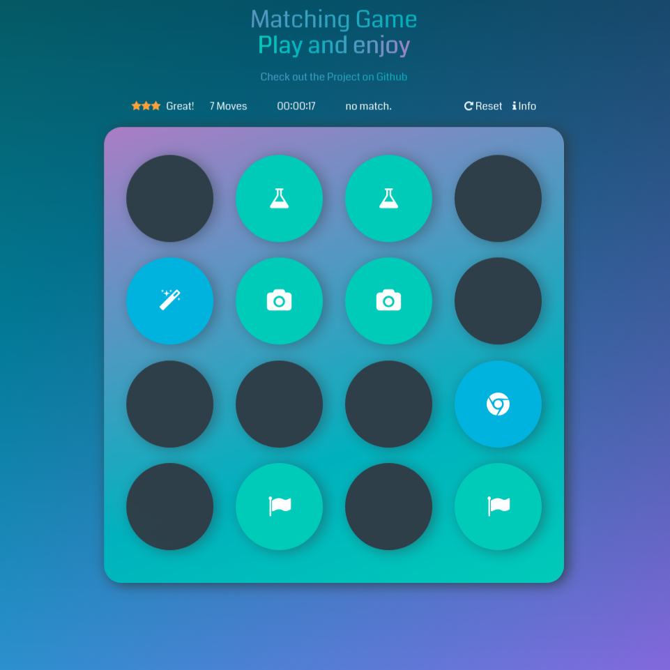

# Udacity Second project
### Front End Web Developer
##### Memory Game

Matching Game! Click the cards to find a match. Match all 16 cards as fast and best as you can.
best record is 10sec!

---

A fun game for users to play! Focuses on DOM manipulation, variables and object-oriented programming.

##### Language, Framwork & library
* HTML5
* CSS3
* jQuery
* Vanilla JS

#### How To Run

* Simply click the link [HERE](https://satar619.github.io/All-in-all/Udacity_Memory_Game/) and machcards!

---
### Project Screenshot

# Abdul Satar Shirzai Yadegari
#### junior Software Developer

### Visit me at:
* [satar619.github.io](https://satar619.github.io)
* [linkedin.com/in/satarsy/](linkedin.com/in/satarsy)

------
