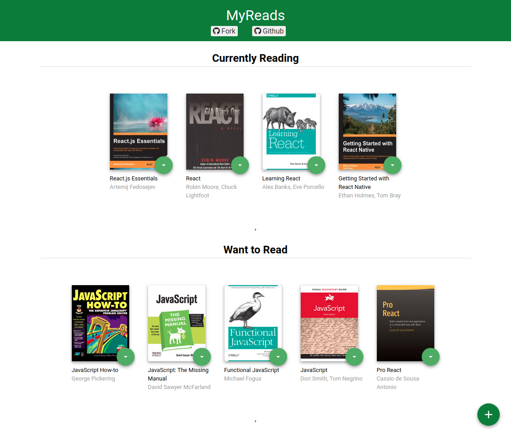
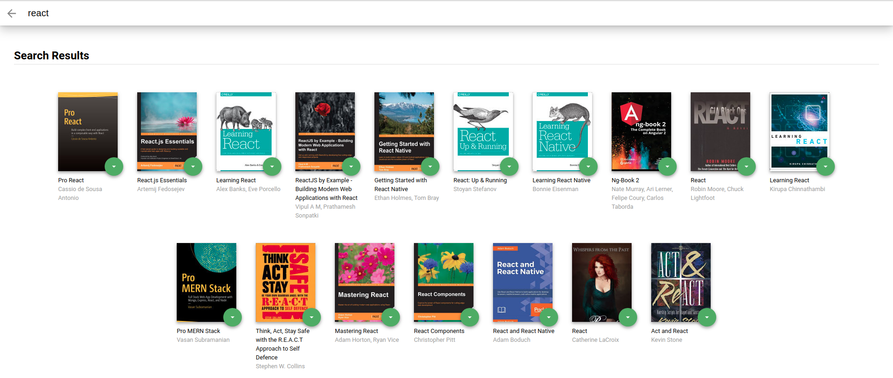

# Udacity My Reads: A Book Tracking App

The application allows you to place selected books into a designated shelf. You can also search the books that will track to google search and Udacity database for books to add to their initial book shelfs. There are two pages, The Homepage displays the three bookshelfs, currently reading, want to read, and read. The search page will allow the user to search for books and add them to your shelfs.

## Prerequisites

To run this application, you will need the following:

* latest version of [Nodejs](https://nodejs.org/en/download/)
* latest version of [npm](https://www.npmjs.com/)

## Installation

Access the projects folder and run `npm install` from the command line to install the dependencies. Once installed run the command `npm start` to load application on  [local host 3000](http://localhost:3000/)

--

## How to use

### Choosing which shelf to send a book to

Once loaded you may choose which shelf to send a book to by clicking on the green circle with a down arrow of any book.

### Search for a book to add to shelf
To access the search page select the plus icon located at the bottom right of the page. Type in the search field for possible books to be found. No results will be displayed if the input field is blank or the query you've typed does not exist.

The process of adding a book to a shelf is identical to the process described in the previous section. Once the option is selected the book will be displayed on the selected shelf on the main page of the application.

To return to the main page you may use the back arrow in the input area at the top or the browsers back arrow.

##### Here is some search tips:

'Android', 'Art', 'Artificial Intelligence', 'Astronomy', 'Austen', 'Baseball', 'Basketball', 'Bhagat', 'Biography', 'Brief', 'Business', 'Camus', 'Cervantes', 'Christie', 'Classics', 'Comics', 'Cook', 'Cricket', 'Cycling', 'Desai', 'Design', 'Development', 'Digital Marketing', 'Drama', 'Drawing', 'Dumas', 'Education', 'Everything', 'Fantasy', 'Film', 'Finance', 'First', 'Fitness', 'Football', 'Future', 'Games', 'Gandhi', 'History', 'History', 'Homer', 'Horror', 'Hugo', 'Ibsen', 'Journey', 'Kafka', 'King', 'Lahiri', 'Larsson', 'Learn', 'Literary Fiction', 'Make', 'Manage', 'Marquez', 'Money', 'Mystery', 'Negotiate', 'Painting', 'Philosophy', 'Photography', 'Poetry', 'Production', 'Program Javascript', 'Programming', 'React', 'Redux', 'River', 'Robotics', 'Rowling', 'Satire', 'Science Fiction', 'Shakespeare', 'Singh', 'Swimming', 'Tale', 'Thrun', 'Time', 'Tolstoy', 'Travel', 'Ultimate', 'Virtual Reality', 'Web Development', 'iOS'

## Screenshot of the main page and search page

### Main page

### Search page
