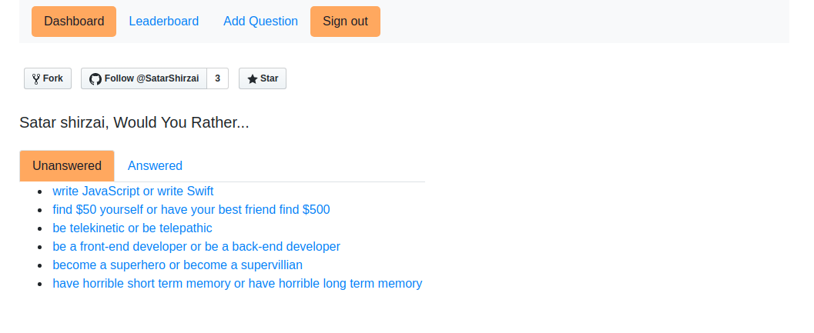
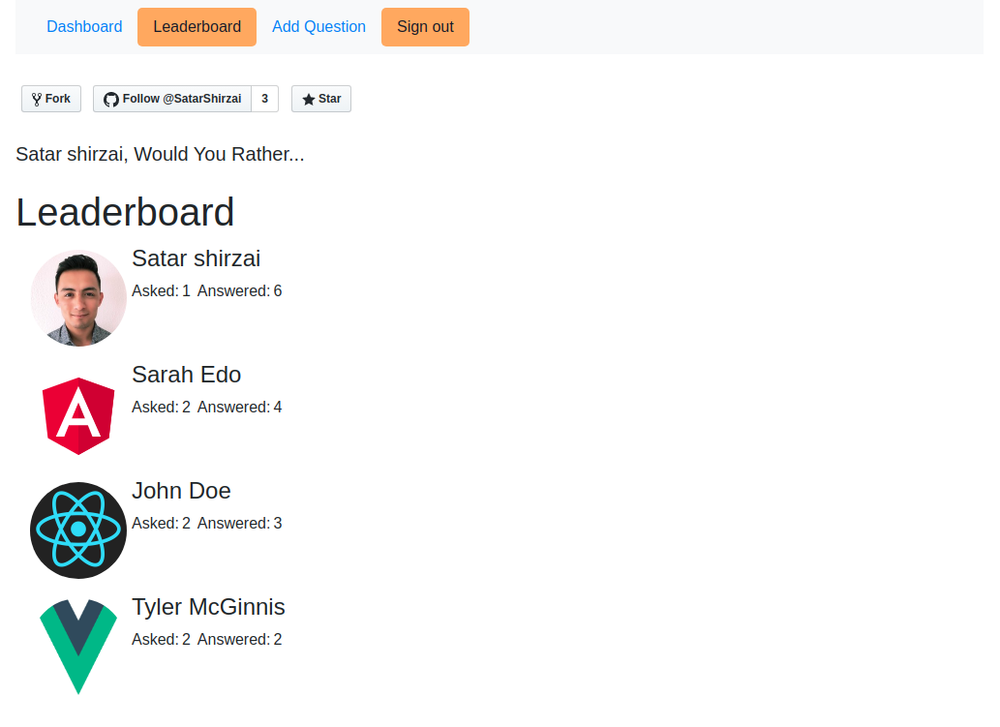

# Udacity Would You Rathre

The 'Would you rather' is a ReactJS app that allows users to login, ask and answer different poll questions. It will also show a leaderboard based on the number of questions each user has asked and answered. 

## Prerequisites

To run this application, you will need the following:

* latest version of [Nodejs](https://nodejs.org/en/download/)
* latest version of [npm](https://www.npmjs.com/)

## Installation

* 1 First of all You need to [download](https://github.com/SatarShirzai/Udacity_Projects/archive/master.zip)or [Clone](https://github.com/SatarShirzai/Udacity_Projects.git) the repo and:
* 2 Access the projects folder
* 3 run `npm install` from the command line to install the dependencies.
* 4 Once installed run the command `npm start` to load application on  [local host 3000](http://localhost:3000/)

## Screenshot of the main page and search page

### Main page

### Dashboard page

### Leaderboard page

