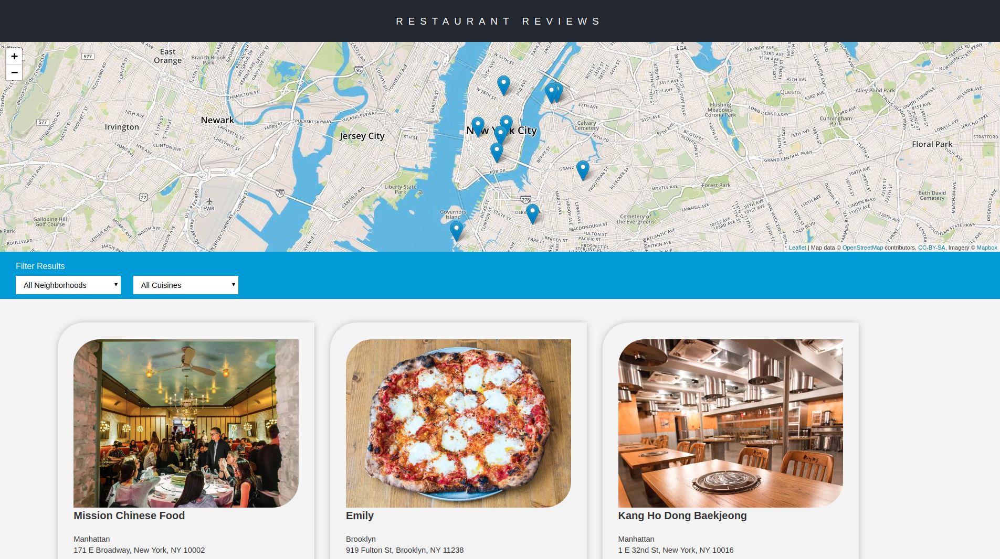
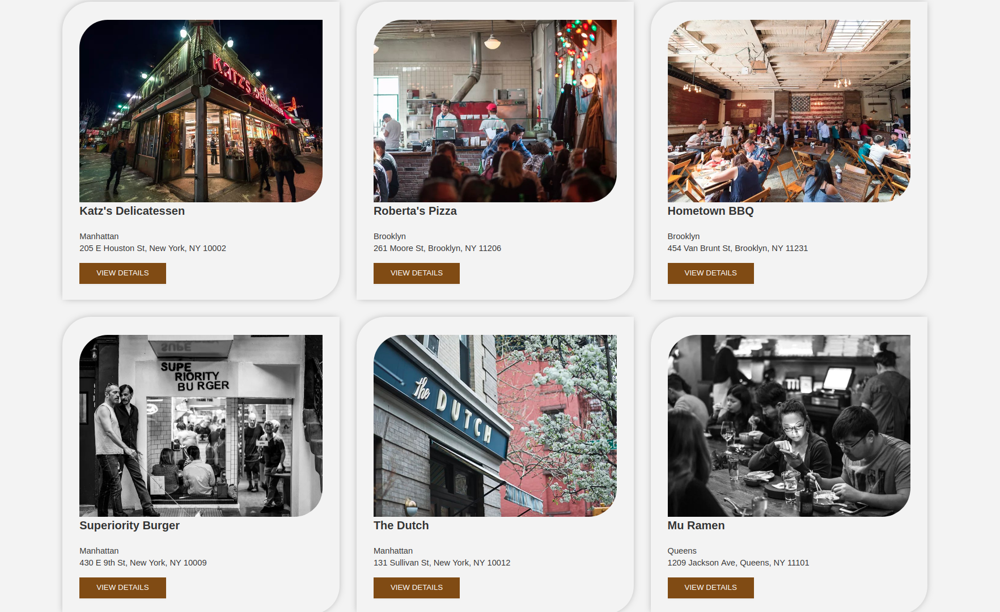
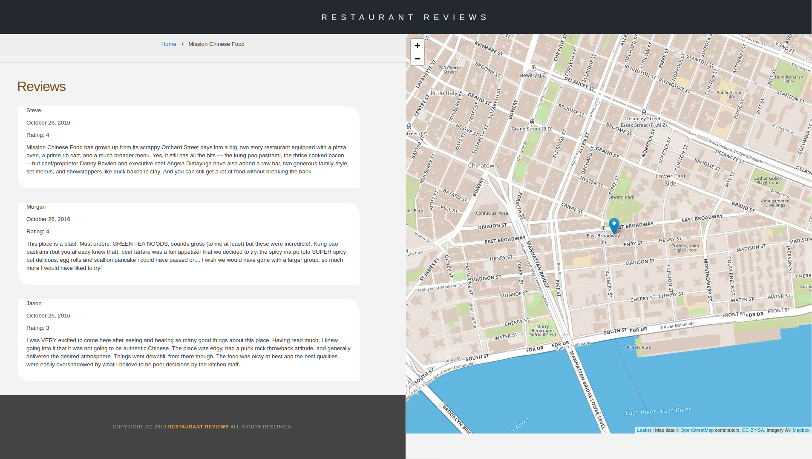

# Mobile Web Specialist Certification Course
---
# Udacity Restaurant Reviews App project
### Front End Web Developer
##### Restaurant Reviews App

## Overview

In this project, I incrementally converted a static webpage to a mobile-ready web application. I took a static design that lacked accessibility and converted the design to be responsive on different sized displays and accessible for screen reader use. I also added a service worker to begin the process of creating a seamless offline experience for the users.

---
## Specification

I was provided with the code for a restaurant reviews website. This code had a lot of issues. It was barely usable on a desktop browser, much less a mobile device. It also didn’t include any standard accessibility features, and it didn't work offline at all. My job was to update the code to resolve these issues while still maintaining the included functionality.
[This is original code from Udacity](https://github.com/udacity/mws-restaurant-stage-1).

#### How To Run

To run the project, download or clone the repository in your computer:

`$ git clone https://github.com/Satar619/Udacity_Projects.git`

and follow the instructions below:

* First go to the *Restaurant-reviews-app* then: 
* In the folder, start up a simple HTTP server to serve up the site files on your local computer. Python has some simple tools to do this, and you don't even need to know Python. For most people, it's already installed on your computer. 

* In a terminal (like Git Bash, Cygwin or the Windows terminal), check the version of Python you have: `python -V`. If you have Python 2.x, spin up the server with `python -m SimpleHTTPServer 8000` (or some other port, if port 8000 is already in use.) For Python 3.x, you can use `python3 -m http.server 8000` or `python -m http.server 8000`. If you don't have Python installed, navigate to Python's [website](https://www.python.org/) to download and install the software.

* With your server running, visit the site: `http://localhost:8000`. You can now see the live site. **EVEN OFLINE**

---
### Project Screenshot

# Abdul Satar Shirzai Yadegari
#### junior Software Developer

### Visit me at:
* [satar619.github.io](https://satar619.github.io)
* [linkedin.com/in/satarsy/](linkedin.com/in/satarsy)

------
